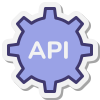
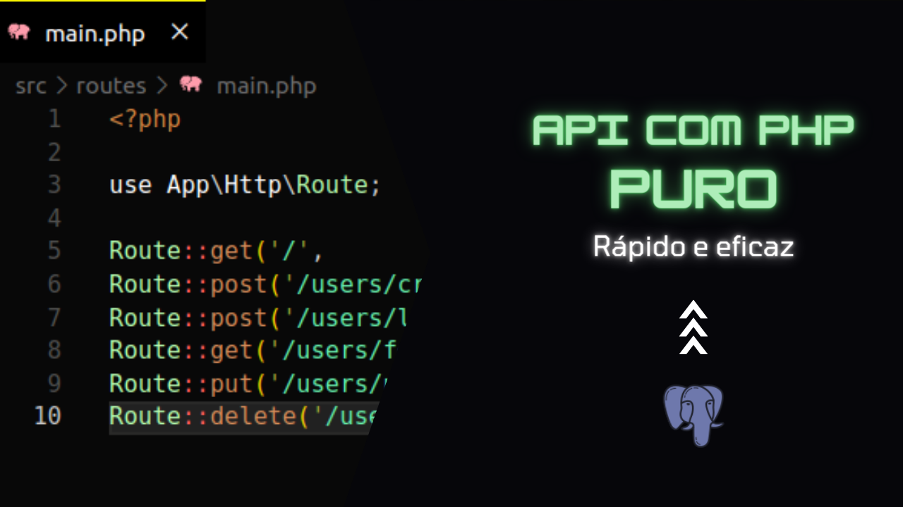

<h1 align="center">
  <br />
  
  <br />
  API com PHP
  <br />
</h1>

<p align="center">
  Este repositório contém o <b>código-fonte</b> de uma <b>API</b> desenvolvida em <b>PHP</b> puro. A <b>API</b> é demonstrada em um vídeo tutorial disponível no <b>YouTube</b>, criado pelo autor deste repositório.
</p> 
<p align="center">
  O vídeo tutorial associado a este repositório pode ser acessado <a href="https://www.youtube.com/watch?v=5fg5NG2ucsA">aqui</a>. 🚀
</p>

<p align="center">
  Se gostou, deixe sua 🌟 no projeto!
</p>



### Descrição

A API em PHP puro foi desenvolvida como parte de um tutorial prático, projetado para ensinar os conceitos fundamentais de criação de APIs usando PHP. No vídeo tutorial associado a este repositório, você aprenderá a construir uma API simples, utilizando apenas PHP e algumas práticas recomendadas.

### Vídeo Tutorial

O vídeo tutorial associado a este repositório pode ser acessado <a href="https://www.youtube.com/watch?v=5fg5NG2ucsA">aqui</a>.

Principais Recursos:
  * PSR-4
  * HTTP
    * Request
    * Response
    * HTTP Method
  * Autenticação por JWT
  * Rotas
  * Banco de Dados
  * CRUD (Create, Read, Update, Delete)

### Execução

```sh

# Clone Repository
$ git clone https://github.com/EricNeves/yt-api-com-php.git

# Folder
$ cp yt-api-com-php/ /var/www/html

# Install Dependencies - PHP
$ cd yt-api-com-php/ && composer update

```

Mova o projeto para dentro do seu servidor Apache ou NGINX:

* API: http://localhost/yt-api-com-php/ 

### License 


### Author 🧑‍💻
<a href="https://www.instagram.com/ericneves_dev/"></a> <a href="https://linkedin.com/in/ericnevesrr"> </a>
